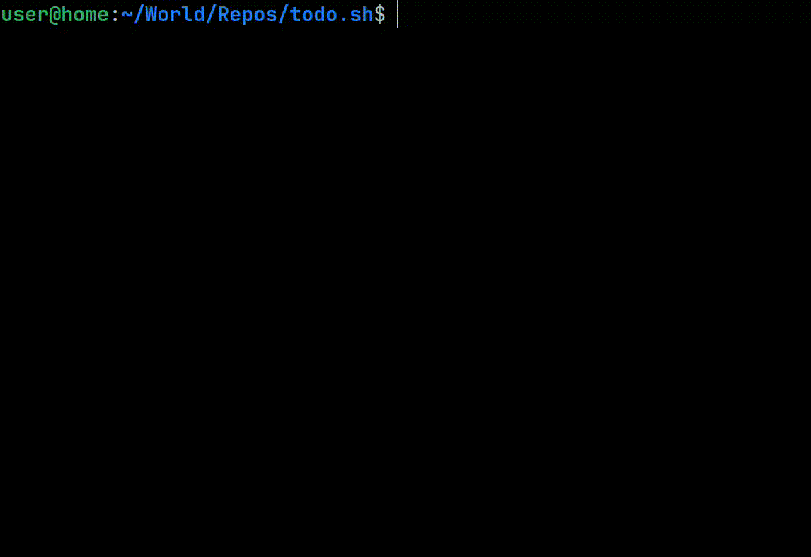

# Todos on the command line

Bash is fun to use if one accepts its quirk of course.



# Bash version
GNU bash, version 5.1.16

# Comfortable cli experience
Add this to your .bashrc, .zshrc or the like
```sh
alias t="~/path-to-repo/todo.sh"
```

